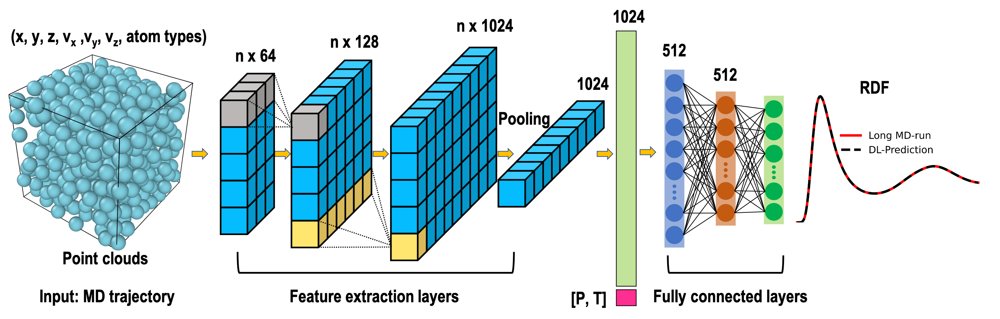

# PointNet-RDF-MDTraj
This repository contains the code and resources used in the paper:
> **"Rapid Prediction of a Liquid Structure from a Single Molecular Configuration Using Deep Learning"**  
> Authors: Chunhui Li, Benjamin Gilbert, Steven Farrell, Piotr Zarzycki 
> Published in Journal of Chemical Information and Modeling, 2023 
> Link to the paper: [https://pubs.acs.org/doi/10.1021/acs.jcim.3c00472](https://pubs.acs.org/doi/10.1021/acs.jcim.3c00472)

Predict RDF distribution from a single molecular configuration dumped from MD trajectory. The original paper is found at 

## Data sets 
MD trajectories are stored in `NPZ` format. A `NPZ` file contains: 
- `x`: Basic information to describe the current states of atoms: coordination, velocities, etc  
- `y`: target RDF values
- `sys`: thermodynamic condition (P, T) to perform the MD simulation
- `frame`: In which frame the MD information is extracted

The data used to train the model are available at: https://zenodo.org/record/7776442. 

*Due to the large amount of data, after decompressing the folder, the bz2 files inside also need to be decompressed to npz files.*

## train the model on different liquid systems  
e.g. train on Ar system: `python Ar_rdfxyzPT_finer_NPZ.py`

